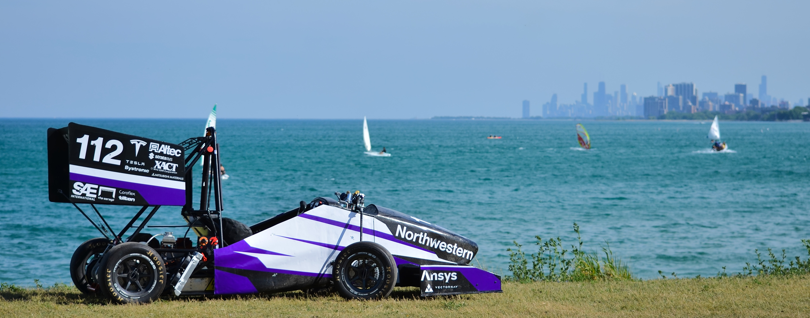
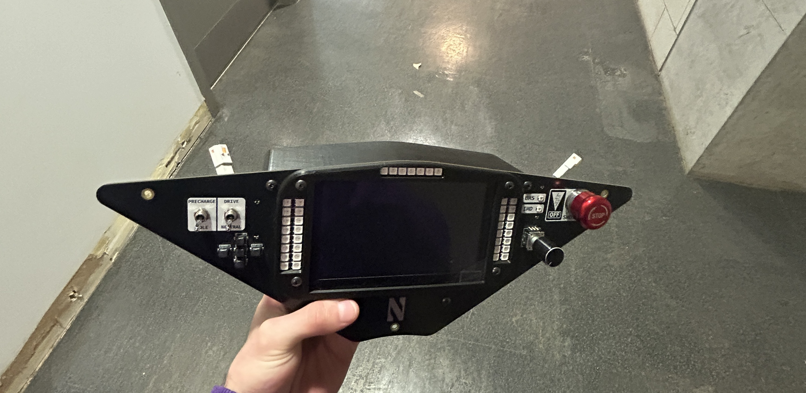
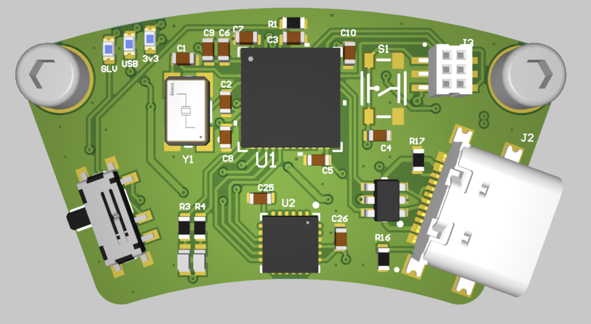

 
    

        
    

  <h1 align="center"> Hi, I'm Daniel! 👋 </h1>
  
  
  
  

### About me

I'm a senior at 🟣 Northwestern University ⚪️ studying computer engineering 👨‍💻. I'm interested in embedded systems and application development, specifically in C++ or C. I'm also the data aqcuisition lead for Northwestern Formula Racing 🏎️. Check out some of my work 😁:

* 🚌 [NFR CAN Library](https://github.com/danielk125/nfr-can-library) - custom c++ library for interfacing with CAN controllers
* 📺 [NFR Dashboard Application](https://github.com/NU-Formula-Racing/daq-dash-26) - c++ application for car dashboard developed on raspberry pi cm4
* 🌳 [Bird Sanctuary Plant Tracker](https://github.com/kev1n/BIRD-plant-tracker) - web application for tracking sanctuary plants over time

---

### Hardware

I've also dabbled in ⚡️ electronics and PCB design ⚡️ as a part of Northwestern Formula Racing, check out some of the boards I've worked on:

  <table>
    <tr>
      <td align="center"> <em>NFR26 Dashboard</em></td>
      <td align="center"> <em>NFR27 Steering Angle Sensor Board</em></td>
    </tr>
  </table>

---

### Skills and Technologies

<!--
**danielk125/danielk125** is a ✨ _special_ ✨ repository because its `README.md` (this file) appears on your GitHub profile.

Here are some ideas to get you started:

- 🔭 I’m currently working on ...
- 🌱 I’m currently learning ...
- 👯 I’m looking to collaborate on ...
- 🤔 I’m looking for help with ...
- 💬 Ask me about ...
- 📫 How to reach me: ...
- 😄 Pronouns: ...
- ⚡ Fun fact: ...
-->
